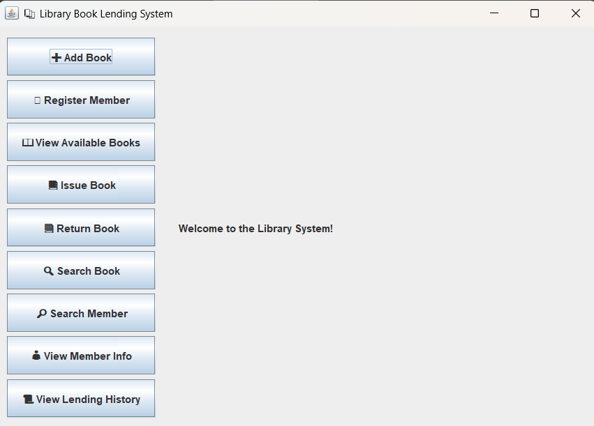
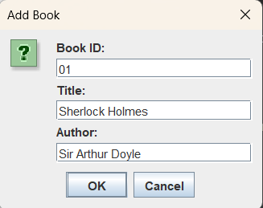
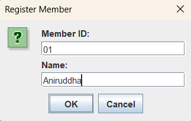
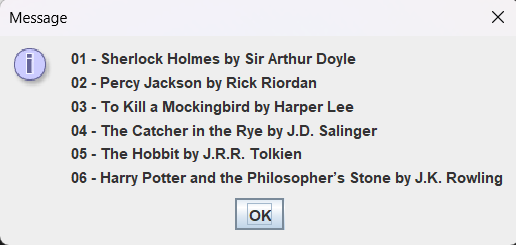
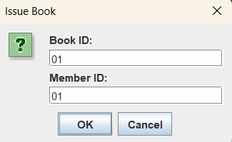
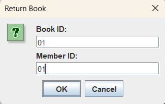
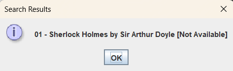
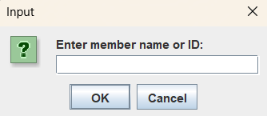
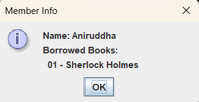
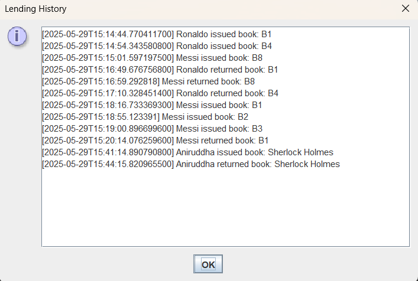

📚 Library Book Lending System

A Java Swing-based application for managing a small library system. This system allows users to manage books, register members, issue and return books, search, and view lending history with timestamps.

🚀 How to Run

https://github.com/R3trox/Library_Management

Requirements:

Java Development Kit (JDK) 8 or above

An IDE like IntelliJ IDEA, Eclipse, or any text editor

Optionally, terminal/command prompt for compilation and execution

Steps:

1. Using IDE:

Open your IDE and import the project folder containing the .java files.

Set the MainGUI class as the main class.

Run the application.

2. Using Terminal (Command Line):

Navigate to the directory containing the source files, e.g., src/com/example/library.

cd path/to/src
javac com/example/library/*.java
java com.example.library.MainGUI

Make sure you are at the root of the src folder when running the javac and java commands.

📋 Overview of the System

This library system supports the following features:

✅ Core Features:

Add Book – Input book ID, title, and author to add a new book to the system.

Register Member – Register a member by entering a unique ID and name.

View Available Books – Display a list of all books currently available for borrowing.

Issue Book – Issue a book to a registered member (limit: 3 books per member).

Return Book – Allow members to return borrowed books.

Search Book – Search books by title or author (case-insensitive).

Search Member – Search members by name or member ID.

View Member Info – View a member's current borrowed books.

View Lending History – Shows a timestamped log of all book issue and return events.

💾 Data Handling:

All library data (books, members, transactions) is stored in memory and saved upon application closure.

Lending history is tracked and displayed via a scrollable GUI component.

🖥️ User Interface:

Developed using Java Swing.
